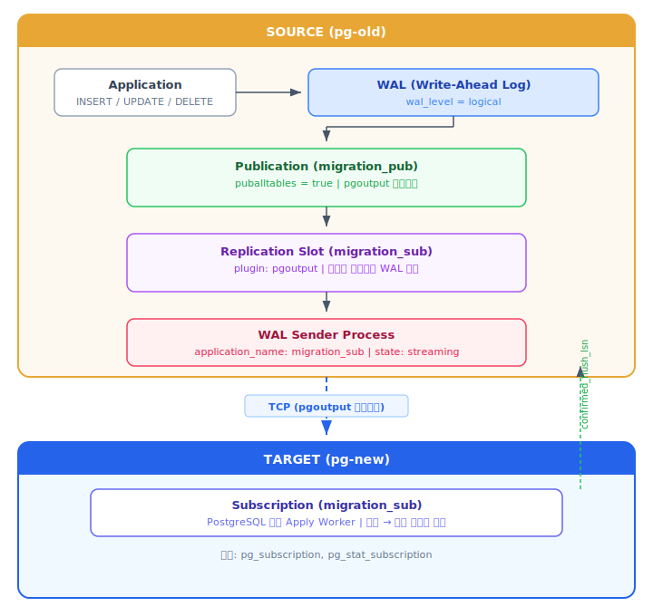
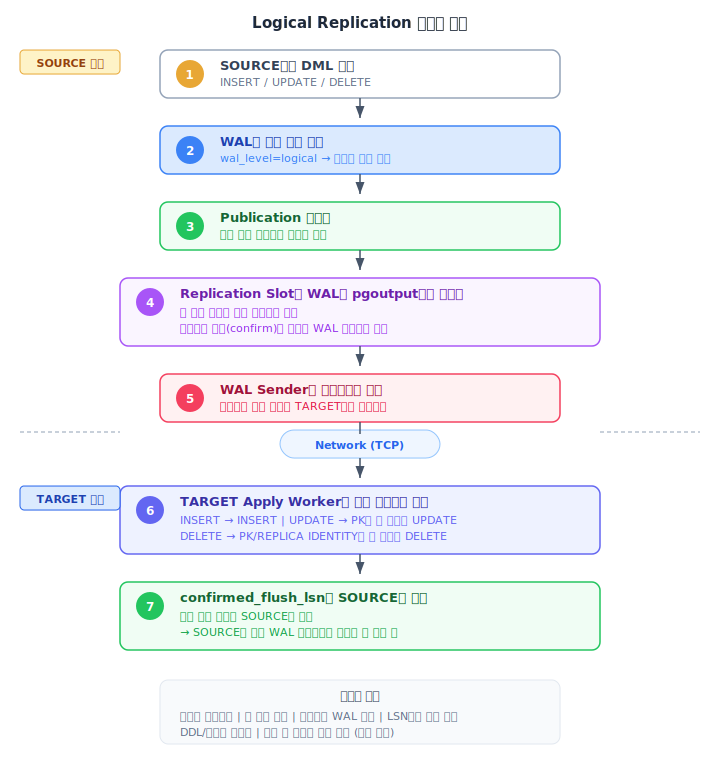
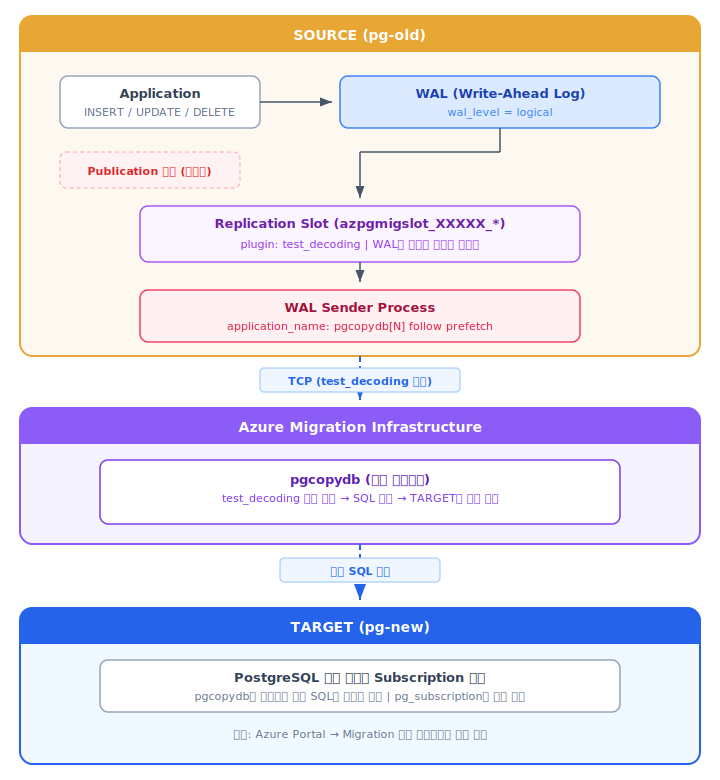
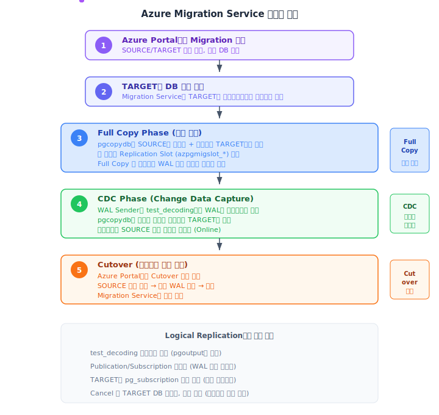

# PostgreSQL 마이그레이션 방식 비교: Logical Replication vs Azure Migration Service

> Azure Database for PostgreSQL Flexible Server 간 마이그레이션 시  
> 사용할 수 있는 두 가지 Online 복제 방식을 비교합니다.

---

## 용어 정리

| 용어 | 설명 |
|------|------|
| **Logical Replication** | PostgreSQL 엔진에 내장된 논리적 복제 기능 (`CREATE PUBLICATION` / `CREATE SUBSCRIPTION`) |
| **Azure Migration Service** | Azure Portal → PostgreSQL Flexible Server → Migration 메뉴에서 제공하는 마이그레이션 서비스 |

---

## 1. Logical Replication (PostgreSQL 내장)

### 동작 원리

PostgreSQL 엔진에 내장된 publish-subscribe 모델의 논리적 복제입니다.



### 동기화 흐름



### 구성 요소 (PostgreSQL 시스템 카탈로그)

| 위치 | 카탈로그 | 설명 |
|------|----------|------|
| SOURCE | `pg_publication` | 발행 정의 (어떤 테이블을 복제할지) |
| SOURCE | `pg_replication_slots` | 복제 슬롯 (`pgoutput` 플러그인) |
| SOURCE | `pg_stat_replication` | WAL Sender 상태 (streaming/catchup) |
| TARGET | `pg_subscription` | 구독 정의 (어떤 publication을 받을지) |
| TARGET | `pg_stat_subscription` | Apply Worker 상태 (received_lsn 등) |

### 설정 (사용자가 직접 SQL로 구성)

```sql
-- 1. SOURCE: Publication 생성
CREATE PUBLICATION migration_pub FOR ALL TABLES;

-- 2. TARGET: Subscription 생성 (이때 초기 데이터 복사도 자동 수행)
CREATE SUBSCRIPTION migration_sub
    CONNECTION 'host=pg-old.postgres.database.azure.com dbname=mydb user=<adminuser> password=*** sslmode=require'
    PUBLICATION migration_pub
    WITH (copy_data = true);

-- 3. 복제 상태 확인 (SOURCE)
SELECT slot_name, active, confirmed_flush_lsn
FROM pg_replication_slots;

-- 4. 복제 지연 확인 (SOURCE)
SELECT application_name, state, sent_lsn, replay_lsn,
       sent_lsn - replay_lsn AS lag
FROM pg_stat_replication;
```

### 초기 데이터 동기화 방식

Subscription 생성 시 `copy_data = true` (기본값)이면:

1. TARGET의 Apply Worker가 SOURCE에 접속
2. **테이블 단위로 COPY** 수행 (pg_dump가 아닌 내부 COPY 프로토콜)
3. COPY 완료 후 **WAL 스트리밍으로 전환**하여 실시간 복제 시작
4. COPY 중 SOURCE에 발생한 변경 사항도 WAL에서 catch-up

### 중단/재개

```sql
-- 일시 중단
ALTER SUBSCRIPTION migration_sub DISABLE;

-- 재개 (중단 지점부터 이어서 복제)
ALTER SUBSCRIPTION migration_sub ENABLE;
```

> 슬롯이 유지되므로 중단 중에도 WAL이 보존됩니다.  
> 단, 장시간 중단 시 SOURCE의 디스크 사용량이 증가합니다.

---

## 2. Azure Migration Service (Azure Portal 통합)

### 동작 원리

Azure Portal의 Flexible Server → Migration 메뉴에서 제공하는 관리형 마이그레이션 서비스입니다.  
내부적으로 **pgcopydb**를 사용하며, PostgreSQL의 `test_decoding` 플러그인으로 WAL을 디코딩합니다.



### 동기화 흐름



### 구성 요소

| 위치 | 구성 요소 | 설명 |
|------|-----------|------|
| SOURCE | `pg_replication_slots` | `azpgmigslot_*` 슬롯 (`test_decoding` 플러그인) |
| SOURCE | `pg_stat_replication` | `pgcopydb[N] follow prefetch` WAL Sender |
| SOURCE | `pg_publication` | **사용하지 않음** (없음) |
| TARGET | `pg_subscription` | **사용하지 않음** (없음) |
| TARGET | Azure Portal | Migration 상태, 진행률, 테이블별 복사 현황 확인 |

### 설정 (Azure Portal UI)

사용자가 SQL을 직접 작성할 필요 없이 Portal에서 설정합니다:

1. Azure Portal → PostgreSQL Flexible Server (TARGET) → **Migration** 메뉴
2. **+ Create** 클릭
3. SOURCE 접속 정보 입력 (호스트, 포트, 사용자, 비밀번호)
4. 마이그레이션할 DB 선택
5. Migration mode: **Online** 선택
6. 검증 후 마이그레이션 시작

> SOURCE에서 필요한 사전 설정:  
> - `wal_level = logical`  
> - 사용자에 `REPLICATION` 권한  
> - 네트워크 접근 허용 (방화벽)

### 중단/재개

- Azure Portal에서 Migration을 **Cancel** 하면:
  - TARGET DB가 **삭제**됨
  - SOURCE의 `azpgmigslot_*` 슬롯이 제거됨
  - pgcopydb WAL Sender가 사라짐
- 재개하려면 **새로운 Migration을 처음부터** 생성해야 함

---

## 3. 핵심 차이점 비교

### WAL 디코딩 방식

| 항목 | Logical Replication | Azure Migration Service |
|------|--------------------|-----------------------|
| **디코딩 플러그인** | `pgoutput` | `test_decoding` |
| **출력 형식** | 바이너리 프로토콜 (효율적) | 텍스트 기반 (사람이 읽을 수 있는 형태) |
| **Publication 필요** | O (발행 대상 필터링) | X (WAL 전체를 직접 디코딩) |

### SOURCE 측 비교

| 항목 | Logical Replication | Azure Migration Service |
|------|--------------------|-----------------------|
| **Replication Slot 이름** | 사용자 지정 (예: `migration_sub`) | 자동 생성 (`azpgmigslot_*`) |
| **Slot 플러그인** | `pgoutput` | `test_decoding` |
| **WAL Sender 이름** | `migration_sub` | `pgcopydb[N] follow prefetch` |
| **Publication** | `CREATE PUBLICATION` 필요 | 불필요 |

### TARGET 측 비교

| 항목 | Logical Replication | Azure Migration Service |
|------|--------------------|-----------------------|
| **DB 생성** | 사용자가 직접 생성 | Migration Service가 자동 생성 |
| **스키마 생성** | 사용자가 직접 (`pg_dump` → `pg_restore`) | Migration Service가 자동 |
| **수신 방식** | PostgreSQL 내장 Apply Worker | 외부 pgcopydb 프로세스 |
| **엔진 내 흔적** | `pg_subscription`, `pg_stat_subscription` | **없음** |
| **복제 상태 확인** | `SELECT * FROM pg_stat_subscription` | Azure Portal에서만 확인 |

### 운영/관리 비교

| 항목 | Logical Replication | Azure Migration Service |
|------|--------------------|-----------------------|
| **설정 복잡도** | 높음 (SQL 직접 구성) | 낮음 (Portal UI) |
| **테이블 선택 복제** | O (`FOR TABLE t1, t2`) | 제한적 (DB 단위) |
| **초기 복사 방식** | Subscription의 COPY 프로토콜 | pgcopydb의 병렬 COPY |
| **시퀀스 동기화** | `setval()` 수동 실행 필요 | Migration Service가 처리 |
| **중단 후 재개** | 슬롯 유지, 이어서 복제 | 새로 시작해야 함 |
| **DDL 복제** | 불가 (수동 실행) | 불가 (초기 복사 시 스키마 포함) |

---

## 4. 공통점

두 방식 모두 PostgreSQL WAL 기반으로 동작하며, 아래 특성을 공유합니다:

| 항목 | 설명 |
|------|------|
| **기반 기술** | PostgreSQL WAL (Write-Ahead Log) |
| **복제 방향** | SOURCE → TARGET 단방향 |
| **DML 복제** | INSERT, UPDATE, DELETE |
| **DDL 복제** | **불가** (`CREATE TABLE`, `ALTER TABLE` 등은 복제되지 않음) |
| **시퀀스 복제** | **불가** (시퀀스 객체의 `last_value`는 복제되지 않음) |
| **Large Object** | **불가** (`pg_largeobject`는 복제되지 않음) |
| **요구 조건** | `wal_level = logical`, 사용자에 `REPLICATION` 권한 |
| **확인 위치** | SOURCE의 `pg_replication_slots`, `pg_stat_replication`에서 슬롯/WAL Sender 확인 가능 |

---

## 5. 독립성 검증 결과

두 방식은 **서로 다른 Replication Slot과 WAL Sender**를 사용하므로 완전히 독립적으로 동작합니다.

동일 SOURCE 서버에서 DB별로 각각 다른 방식을 적용하여 검증한 결과:

| 검증 단계 | 상태 | 결과 |
|-----------|------|------|
| **Step 1** | Logical Replication만 동작 | LR 구성 요소만 존재, Migration Service 흔적 없음 |
| **Step 2** | 두 방식 동시 동작 | 각각 별도 슬롯/WAL Sender 생성, 서로 영향 없음 |
| **Step 3** | LR 중단, Migration Service만 동작 | LR 중단이 Migration Service에 영향 없음 |

### Step 2 상태 (동시 동작 시 SOURCE의 pg_replication_slots)

| slot_name | plugin | database | active |
|-----------|--------|----------|--------|
| `migration_sub` | pgoutput | adventureworks | t |
| `azpgmigslot_28427_*` | test_decoding | adventureworks2 | t |

### Step 3 데이터 검증 (LR 중단 후)

| DB | 방식 | SOURCE INSERT | TARGET 결과 |
|----|------|---------------|-------------|
| adventureworks | Logical Replication (중단) | 3건 INSERT | **미도착** (0 rows) |
| adventureworks2 | Azure Migration Service (동작) | 3건 INSERT | **정상 도착** (3 rows) |

> 각 방식이 독립적인 슬롯과 WAL Sender를 사용하므로,  
> 한쪽의 중단/장애가 다른 쪽에 전혀 영향을 주지 않습니다.

---

## 6. 선택 가이드

| 상황 | 권장 방식 |
|------|----------|
| 빠르고 간편한 마이그레이션 | **Azure Migration Service** |
| 테이블 단위 선택적 복제 | **Logical Replication** |
| 장기 운영 중 양쪽 동시 운영 (Blue-Green) | **Logical Replication** |
| 중단 후 이어서 복제 필요 | **Logical Replication** |
| PostgreSQL 외부 도구 의존 최소화 | **Logical Replication** |
| 스키마/시퀀스 자동 처리 원함 | **Azure Migration Service** |
| Azure 외부 → Azure 마이그레이션 | 두 방식 모두 가능 |

---

## 참고 문서

- [Azure: Logical replication and logical decoding](https://learn.microsoft.com/en-us/azure/postgresql/flexible-server/concepts-logical)
- [Azure: Migrate to Flexible Server by using migration service](https://learn.microsoft.com/en-us/azure/postgresql/migrate/migration-service/overview-migration-service-postgresql)
- [PostgreSQL: Logical Replication](https://www.postgresql.org/docs/current/logical-replication.html)
- [pgcopydb documentation](https://pgcopydb.readthedocs.io/)
