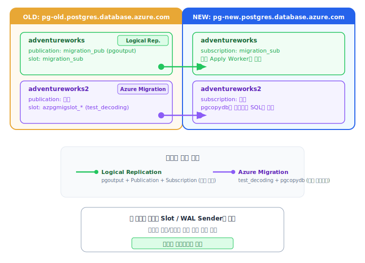

# Replication Verification Log

## 목적
- adventureworks: Logical Replication 동기화
- adventureworks2: Azure Migration (Online) 동기화
- 두 동기화 방식이 PostgreSQL 엔진에서 독립적으로 동작하는지 검증

## 환경
- OLD: pg-old.postgres.database.azure.com
- NEW: pg-new.postgres.database.azure.com
- User: <adminuser>

---

## Step 1: Logical Replication만 동작 중
- **시간**: 2026-03-24 07:25 (UTC)
- **상태**: adventureworks Logical Replication만 활성 / adventureworks2 Migration 중단됨

### [OLD] pg_replication_slots
| slot_name | plugin | database | active | confirmed_flush_lsn |
|---|---|---|---|---|
| migration_sub | pgoutput | adventureworks | t | 1/2001580 |
| _(adventureworks2 슬롯 없음)_ | | | | |

### [OLD] pg_stat_replication (WAL Sender)
| pid | usename | application_name | state | sent_lsn | replay_lsn |
|---|---|---|---|---|---|
| 915 | <adminuser> | migration_sub | streaming | 1/2001680 | 1/2001680 |
| _(pgcopydb 없음)_ | | | | | |

### [OLD] pg_publication
| database | pubname | puballtables |
|---|---|---|
| adventureworks | migration_pub | t |
| adventureworks2 | (없음, 0 rows) | |

### [NEW] pg_subscription
| subname | subenabled | subslotname | subdb | subpublications |
|---|---|---|---|---|
| migration_sub | t | migration_sub | adventureworks | {migration_pub} |

### [NEW] pg_stat_subscription
| subname | worker_type | pid | received_lsn | latest_end_lsn | last_msg_receipt_time |
|---|---|---|---|---|---|
| migration_sub | apply | 1078 | 1/2001AD8 | 1/2001AD8 | 2026-03-24 07:25:57.182604+00 |

### [NEW] Databases
- adventureworks (존재)
- adventureworks2 (없음 - Migration 중단 시 삭제됨)

### Step 1 결론
- Logical Replication 관련 구성 요소만 존재: `migration_sub` slot, `migration_pub` publication, `migration_sub` subscription
- Azure Migration 관련 구성 요소 전무: `azpgmigslot_*` 슬롯 없음, `pgcopydb` WAL sender 없음

---

## Step 2: Logical Replication + Azure Migration (Online) 동시 동작
- **시간**: 2026-03-24 07:33 (UTC)
- **상태**: adventureworks Logical Replication + adventureworks2 Azure Migration (Online) 동시 동작

### [OLD] pg_replication_slots
| slot_name | plugin | database | active | confirmed_flush_lsn |
|---|---|---|---|---|
| migration_sub | pgoutput | adventureworks | t | 1/4017E98 |
| azpgmigslot_28427_20260324_073245 | test_decoding | adventureworks2 | t | 1/4017C40 |

### [OLD] pg_stat_replication (WAL Sender)
| pid | usename | application_name | state | sent_lsn | replay_lsn |
|---|---|---|---|---|---|
| 915 | <adminuser> | migration_sub | streaming | 1/4017F98 | 1/4017F98 |
| 19624 | <adminuser> | pgcopydb[44] follow prefetch | streaming | 1/4017F98 | 1/4010858 |

### [OLD] pg_publication
| database | pubname | puballtables |
|---|---|---|
| adventureworks | migration_pub | t |
| adventureworks2 | (없음, 0 rows) | |

### [NEW] pg_subscription
| subname | subenabled | subslotname | subdb | subpublications |
|---|---|---|---|---|
| migration_sub | t | migration_sub | adventureworks | {migration_pub} |

### [NEW] pg_stat_subscription
| subname | worker_type | pid | received_lsn | latest_end_lsn | last_msg_receipt_time |
|---|---|---|---|---|---|
| migration_sub | apply | 1078 | 1/4018E80 | 1/4018E80 | 2026-03-24 07:34:54.2545+00 |

### [NEW] Databases
- adventureworks (존재)
- adventureworks2 (존재 - Migration이 새로 생성함)

### Step 2 결론 - Step 1과 비교
| 구성 요소 | Step 1 (LR만) | Step 2 (LR + Migration) | 변화 |
|---|---|---|---|
| `migration_sub` 슬롯 | active (pgoutput, adventureworks) | active (pgoutput, adventureworks) | **변화 없음** |
| `azpgmigslot_*` 슬롯 | 없음 | **active (test_decoding, adventureworks2)** | **새로 생성됨** |
| `migration_sub` WAL sender | streaming | streaming | **변화 없음** |
| `pgcopydb` WAL sender | 없음 | **streaming** | **새로 생성됨** |
| `migration_pub` publication | adventureworks에 존재 | adventureworks에 존재 | **변화 없음** |
| adventureworks2 publication | 없음 | 없음 | **변화 없음** (Migration은 publication 불필요) |
| `migration_sub` subscription | adventureworks 전용 | adventureworks 전용 | **변화 없음** |
| NEW adventureworks2 DB | 없음 | 존재 | **Migration이 생성** |

---

## Step 3: Logical Replication 중단 + Azure Migration (Online)만 동작
- **시간**: 2026-03-24 07:37 (UTC)
- **상태**: adventureworks subscription DISABLED / adventureworks2 Migration (Online) 동작 중
- **조치**: `ALTER SUBSCRIPTION migration_sub DISABLE;`

### [OLD] pg_replication_slots
| slot_name | plugin | database | active | confirmed_flush_lsn |
|---|---|---|---|---|
| migration_sub | pgoutput | adventureworks | **f (inactive)** | 1/4019D68 |
| azpgmigslot_28427_20260324_073245 | test_decoding | adventureworks2 | **t (active)** | 1/5000128 |

### [OLD] pg_stat_replication (WAL Sender)
| pid | usename | application_name | state | sent_lsn | replay_lsn |
|---|---|---|---|---|---|
| 19624 | <adminuser> | pgcopydb[44] follow prefetch | streaming | 1/5000548 | 1/401A550 |
| _(migration_sub WAL sender 사라짐)_ | | | | | |

### [NEW] pg_subscription
| subname | subenabled | subslotname | subdb |
|---|---|---|---|
| migration_sub | **f (disabled)** | migration_sub | adventureworks |

### [NEW] pg_stat_subscription
| subname | worker_type | pid | received_lsn | latest_end_lsn | last_msg_receipt_time |
|---|---|---|---|---|---|
| migration_sub | (없음) | (없음) | (없음) | (없음) | (없음) |

### 데이터 동기화 검증
**테스트**: old 양쪽 DB에 각 3건 INSERT 후 new에서 확인

| 테스트 | OLD INSERT | NEW 결과 | 판정 |
|---|---|---|---|
| adventureworks (LR 중단) | `LR_STOP_V2_1~3` 3건 INSERT | **0 rows (도착 안 함)** | LR 중단 확인 |
| adventureworks2 (Migration 동작) | `DMS_LIVE_V2_1~3` 3건 INSERT | **3 rows (정상 도착)** | Migration 정상 동작 확인 |

### Step 3 결론 - Step 2와 비교
| 구성 요소 | Step 2 (LR + Migration) | Step 3 (Migration만) | 변화 |
|---|---|---|---|
| `migration_sub` 슬롯 | active | **inactive** | **LR 중단 반영** |
| `azpgmigslot_*` 슬롯 | active | active | **변화 없음** (독립 동작) |
| `migration_sub` WAL sender | streaming | **사라짐** | **LR 중단 반영** |
| `pgcopydb` WAL sender | streaming | streaming | **변화 없음** (독립 동작) |
| adventureworks 데이터 동기화 | 동작 | **중단** | LR 중단 확인 |
| adventureworks2 데이터 동기화 | 동작 | **동작** | Migration은 LR과 무관하게 독립 동작 |

---

## Step 4: Logical Replication 재개 + 최종 검증
(생략 - Step 3까지의 검증으로 독립성 확인 완료)

---

## 최종 결론: Logical Replication vs Azure Migration (Online)

### 공통점
| 항목 | 설명 |
|---|---|
| 기반 기술 | PostgreSQL WAL (Write-Ahead Log) 기반 |
| 방향 | OLD → NEW 단방향 |
| DML 복제 | INSERT, UPDATE, DELETE 복제 가능 |
| DDL 복제 | **불가** (CREATE TABLE, ALTER TABLE 등은 수동 실행 필요) |
| SEQUENCE 동기화 | CDC 단계에서는 **불가** (Cutover 시 Azure Migration Service만 자동 동기화 ¹) |
| 엔진 내 확인 | `pg_replication_slots`, `pg_stat_replication`에서 확인 가능 |

> ¹ Azure Migration Service는 Cutover 완료 시 초기 마이그레이션에 포함된 시퀀스의 `last_value`를 자동 동기화.  
> CDC 중 수동 추가된 시퀀스는 대상 외. Logical Replication은 수동 `setval()` 필요. (테스트 검증: 2026-03-30)

### 차이점

| 항목 | Logical Replication | Azure Migration (Online) |
|---|---|---|
| **설정 주체** | 사용자가 직접 SQL로 구성 | Azure Portal에서 설정 |
| **OLD 송신 방식** | `pgoutput` 플러그인 + `pg_publication` | `test_decoding` 플러그인, Publication 없음 |
| **OLD Replication Slot** | `migration_sub` (pgoutput) | `azpgmigslot_*` (test_decoding) |
| **OLD WAL Sender** | application: `migration_sub` | application: `pgcopydb[N] follow prefetch` |
| **NEW 수신 방식** | PostgreSQL 내장 `pg_subscription` | PostgreSQL 외부 `pgcopydb` 프로세스 |
| **NEW 엔진 내 흔적** | `pg_subscription`, `pg_stat_subscription`에서 확인 가능 | **없음** (외부 프로세스이므로 엔진에 흔적 없음) |
| **Publication 필요** | O (`puballtables=true` 또는 테이블 지정) | X (WAL을 직접 디코딩) |
| **Subscription 필요** | O (NEW에서 `CREATE SUBSCRIPTION`) | X |
| **초기 데이터 복사** | subscription 생성 시 자동 (copy_data=true) | Migration이 `pgcopydb`로 full copy 수행 |
| **NEW DB 생성** | 사용자가 직접 생성 | Migration이 자동 생성 |
| **중단/재개** | `ALTER SUBSCRIPTION ... DISABLE/ENABLE` | Azure Portal에서 중단/재개 |
| **관리 복잡도** | 높음 (slot, publication, subscription 수동 관리) | 낮음 (Portal UI로 관리) |

### 검증 결과 요약

3단계 검증을 통해 **두 방식이 완전히 독립적**으로 동작함을 확인:

| Step | 상태 | 검증 결과 |
|---|---|---|
| Step 1 | LR만 동작 | LR 구성 요소만 존재, Migration 흔적 없음 |
| Step 2 | LR + Migration 동시 동작 | Migration 추가 시 LR에 영향 없음, 각각 별도 slot/WAL sender 생성 |
| Step 3 | Migration만 동작 (LR 중단) | LR 중단 시 Migration에 영향 없음, 데이터 검증으로 독립성 확인 |

**데이터 동기화 검증 (Step 3):**
- adventureworks (LR 중단): old INSERT → new **미도착** (0 rows)
- adventureworks2 (Migration 동작): old INSERT → new **정상 도착** (3 rows)

### 아키텍처 다이어그램

